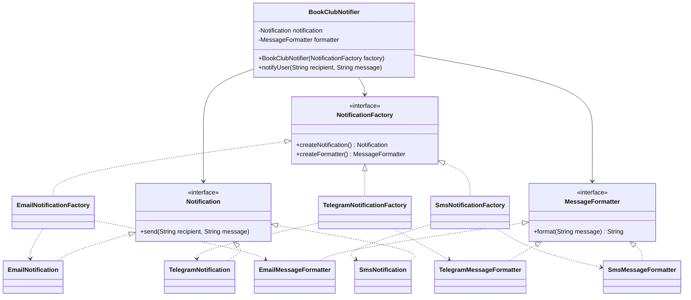

# Abstract Factory — Young Book Lovers Dating Club

## 1. Task

The system needs to create **families of related notification objects** for different communication channels.

For each channel, the application needs two compatible products:

- a notification sender;
- a message formatter.

The chosen pattern is **Abstract Factory**.

This project is designed as an extension of the existing **Young Book Lovers Dating Club** project.

The original project already uses Builder, Factory Method, Singleton, Strategy, Observer, Decorator, Adapter, Chain of Responsibility and Facade. The existing `NotifierFactory` creates one notifier according to a contact channel. This implementation demonstrates a different situation: creating a **family of related objects**. 

## 2. Why Abstract Factory?

Abstract Factory is the best choice because the problem is not only creating one object.

We need to create a matching pair:

```text
Email family
 ├── EmailNotification
 └── EmailMessageFormatter

Telegram family
 ├── TelegramNotification
 └── TelegramMessageFormatter

SMS family
 ├── SmsNotification
 └── SmsMessageFormatter
```

The `NotificationFactory` interface guarantees that both products come from the same family.

The client (`BookClubNotifier`) does not directly use concrete classes. It only works with:

- `Notification`
- `MessageFormatter`
- `NotificationFactory`

Therefore, a new communication family can be added without changing the client.

## 3. Why not Factory Method?

Factory Method is suitable when the main problem is creating **one type of product** while allowing subclasses or a factory method to decide which concrete product is created.

The existing project already demonstrates this idea with:

```text
NotifierFactory -> EmailNotifier / TelegramNotifier / SmsNotifier
```

That is enough when we only need a notifier.

However, this task requires a **family** of related products:

```text
Notifier + Formatter
```

Using Factory Method separately for every product would require several creation decisions and could make it easier to accidentally mix products from different families.

Abstract Factory groups the related creation operations together.

## 4. Why not Builder?

Builder is useful when one complex object must be constructed step by step, especially when it has many optional fields.

For example, the existing project uses:

```java
new User.Builder("Aigerim", 20)
    .city("Almaty")
    .genres(...)
    .authors(...)
    .build();
```

That solves a different problem: constructing one `User` with many optional attributes.

Our problem is not a complex object with many construction steps. We need to select a complete **family of related objects**, so Builder is not the best fit.

## 5. Design

### Abstract Factory

```text
                 NotificationFactory
                  /        |        \
                 /         |         \
        EmailFactory  TelegramFactory  SmsFactory
             |              |             |
             |              |             |
       Notification   Notification   Notification
       Formatter      Formatter      Formatter
```

### Class diagram



## 6. How it works

The client chooses a factory:

```java
NotificationFactory factory = new TelegramNotificationFactory();
```

The factory creates both related products:

```java
Notification notification = factory.createNotification();
MessageFormatter formatter = factory.createFormatter();
```

The client does not need to know the concrete classes.

```java
BookClubNotifier notifier = new BookClubNotifier(factory);
notifier.notifyUser("@aigerim_reads", "The meetup starts at 18:00.");
```

This keeps object creation separated from business logic.

## 7. Advantages

- Creates compatible groups of objects.
- Hides concrete implementation classes from the client.
- Makes adding a new product family easier.
- Reduces direct dependencies on concrete classes.
- Keeps related products consistent.
- Follows the Open/Closed Principle when new families are introduced.

## 8. Trade-off

Abstract Factory adds several interfaces and classes. For a very small system, this can be unnecessary complexity.

It becomes useful when the application has multiple families of related products and the client must switch between those families.

## 9. How to run

Requirements:

- Java 11 or later

Compile:

```bash
cd src
javac *.java
```

Run:

```bash
java Main
```

Or from the project root:

```bash
javac src/*.java
java -cp src Main
```

## 10. Expected output

```text
=== Abstract Factory Demo ===
[EMAIL -> aigerim@mail.kz] Email message: You have a new book match with Arman.
[TELEGRAM -> @aigerim_reads] 📚 The book club meetup starts at 18:00.
[SMS -> +7 701 000 00 00] Your new book match is waiting.
```

## 11. Defense / Oral Explanation

### What pattern did you choose?

I chose **Abstract Factory** because the system needs to create families of related objects. Each communication channel has its own notification sender and message formatter.

### Why not Factory Method?

Factory Method is good for creating one product type. The existing project already uses Factory Method for `Notifier`. Here we need multiple related products, so Abstract Factory is more suitable.

### Why not Builder?

Builder creates one complex object step by step. Our problem is selecting a compatible family of objects, not constructing one object with many optional fields.

### What happens if we add WhatsApp?

We can create:

```text
WhatsAppNotification
WhatsAppMessageFormatter
WhatsAppNotificationFactory
```

The existing `BookClubNotifier` does not need to change.

This is the main benefit of Abstract Factory in this scenario.
